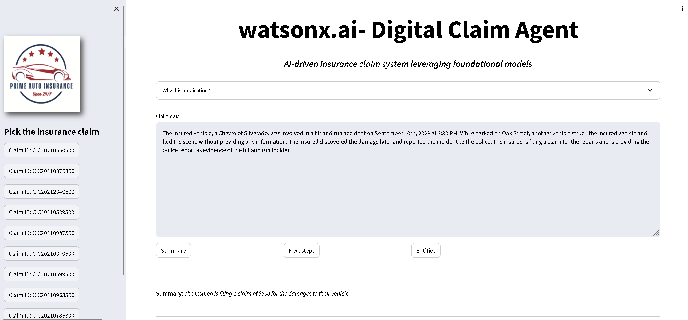

= watsonx-ai-demo

IBM watsonx.ai demo application. Based on https://github.ibm.com/Vincent-MP-Nelis/watsonx-demo-car-insurance.

This demo uses IBM Watson Machine Learning library, https://ibm.github.io/watson-machine-learning-sdk/.
See also https://www.ibm.com/docs/en/watsonx-as-a-service?topic=models-python-library for more instructions.

You need also watsonx service, follow these instructions: https://www.ibm.com/docs/en/watsonx-as-a-service?topic=getting-started. 

== Scenario

Demo scenario is fictional Digital Claim Agent application where AI is used to summarize claim text, get the next actions and extract entities.

== Usage

* Clone the repository
* Build container using provided Docker file:

```
podman build -t watsonx-ai-demo .
```

* Start the container:

```
podman run -it --rm -e MODEL_ID=FLAN_UL2 -e IBM_API_KEY=<your-IBM-cloud-apikey> -e PROJECT_ID=<your-project-id> -e IBM_AI_ENDPOINT=<ai-endpoint> -p 8080:8080 watsonx-ai-demo
```

* Go to http://localhost:8080 

IBM_AI_ENDPOINT is URL to your watsonx service instance. For example,  https://eu-de.ml.cloud.ibm.com, in case using Frankfurt datacenter.

== Modify

If you need to modify the application, take a look at link:app/config.json[config.json]. This JSON includes all text in the UI as well as data and prompts. Modify them for you own use.

== Demo

Demo may or may not be available at https://watsonx-ai-demo.17cwl8ne2aem.eu-de.codeengine.appdomain.cloud/.

.watsonx.ai - Digital Claim Agent
